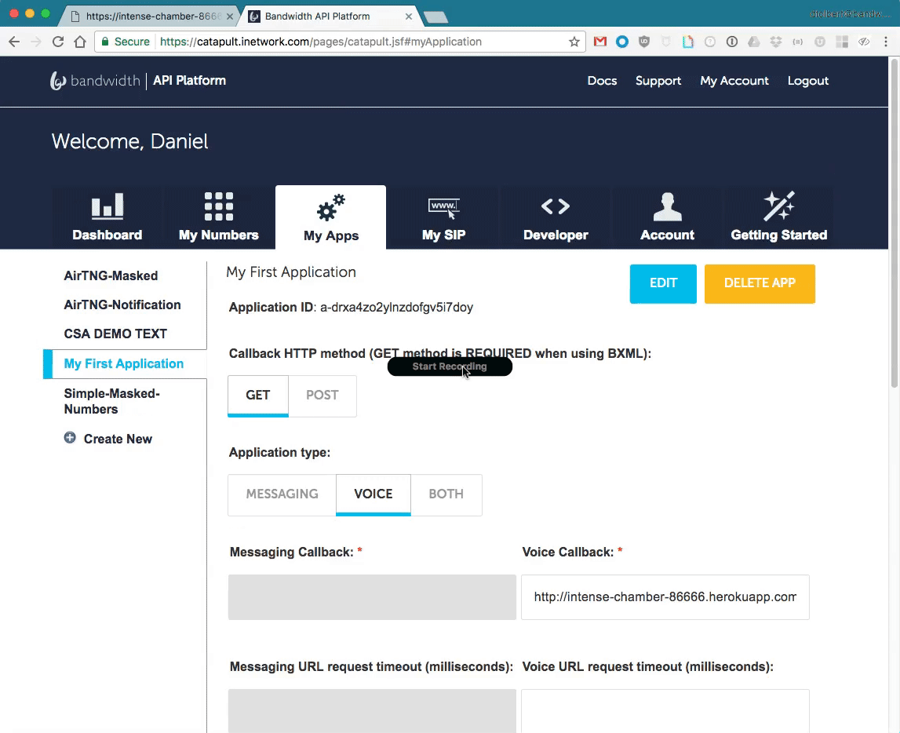

# Cat-Blocks

BXML Builder for use with [Bandwidth Voice and Messaging APIs](http://dev.bandwidth.com).


|                                                                                                                                         |                                                              |
|:----------------------------------------------------------------------------------------------------------------------------------------|:-------------------------------------------------------------|
| [](https://heroku.com/deploy?template=https://github.com/inetCatapult/cat-blocks) | **Must have github and heroku connected for button to work** |


## Pre-reqs

* [AWS S3 Access](https://aws.amazon.com/s3/)

## Env vars

| Name                    | Default                  | Use                                                                                                        |
|:------------------------|:-------------------------|:-----------------------------------------------------------------------------------------------------------|
| `PORT`                  | `3000`                   | Set port to listen on                                                                                      |
| `CATBLOCKS_USERNAME`    | `'catapult'`             | Username to log into the cat-blocks                                                                        |
| `CATBLOCKS_PASSWORD`    | `'catnip'`               | Password to log into the cat-blocks                                                                        |
| `CATBLOCKS_KEY`         | `'bxml'`                 | Special key to hash and store BXML                                                                         |
| `CATBLOCKS_BUCKET`      | `'test-cat-blocks-bxml'` | AWS S3 bucket name                                                                                         |
| `CATBLOCKS_RAND_LENGTH` | `15`                     | Length of uuid for the location of the saved bxml                                                          |
| `AWS_ACCESS_KEY_ID`     | **Required**             | AWS access key. Learn more at [amazon](https://aws.amazon.com/blogs/security/wheres-my-secret-access-key/) |
| `AWS_SECRET_ACCESS_KEY` | **Required**             | AWS secret key. Learn more at [amazon](https://aws.amazon.com/blogs/security/wheres-my-secret-access-key/) |

## Local Deployment
* [ngrok](https://ngrok.com/) Installed with account
* [Setup Ngrok](#hosting-with-ngrok)
* [Run Application](#installing-and-running)

## Creating your first BXML

1. [Create the BXML in cat-blocks](#create-some-bxml)
2. [Setup the Bandwidth Application](#setup-bandwidth-application)
3. [Order Phone Number](#order-phone-number)
3. [Assign phone number to the Bandwidth Application](#setup-phone-number)
4. [Call the phone number!](#test-it-out)

### Create some BXML

1. Click the 
2. Click the 
3. Choose the 
4. Click the 


### Setup Bandwidth Application

1. Log into your [Bandwidth Account](https://catapult.inetwork.com/pages/login.jsf)
2. Go to the **My Apps** tab at the top.
3. Click the 
4. Give your new app a name like `My First App`
5. Make Sure the **Callback HTTP** method is set to `GET`
6. Set the **Application Type** to `Voice`
7. Paste the URL from the BXML builder like `http://site.com/bxml/a33672e40c1a65` into the **Voice Callback** field.
8. Make sure that **Automatically answer incoming calls** is `checked`
9. Click the **SAVE** Button


### Order Phone Number

1. Go to the **My Numbers** Tab
2. Clear out the `California` State so that it's blank
3. In the **ZIP Code** field put `27606`.
4. Click the **Search** button.
5. Click the **tick box** next to a number you like.
6. Click the **Get Numbers** button after selecting a number.


### Setup Phone Number

1. Go back to **My Apps** tab.
2. Select the **Application** we just created on the left. Something like `My First Application`
3. At the bottom click the **ADD NUMBERS** Button
4. In the box that pops up, select your number by clicking the **tick box**.
5. Click the **ADD NUMBERS** Button
6. Done!!!



### Test it out

After adding the phone number to your application, you can now call the number and use your BXML

<a href="https://www.youtube.com/watch?v=dzlpf5436oo" target="_blank">  </a>


## Hosting with ngrok

[Ngrok](https://ngrok.com) is an awesome tool that lets you open up local ports to the internet.


Once you have ngrok installed, open a new terminal tab and navigate to it's location on the file system and run:

```bash
$ cd ~/Downloads/
$ ./ngrok http 3000
```

You'll see the terminal show you information


Copy the `http://8a543f5f.ngrok.io` link and paste it into your browser.

## Installing and running

Once [ngrok](#hosting-with-ngrok) is up and running. Open a new tab and clone the repo:

```bash
git clone https://github.com/inetCatapult/cat-blocks
```

Then change into the directory.

```bash
cd cat-blocks
```

### Install node modules

```bash
npm install
```

### Run the app

`debug` uses [`nodemon`](https://www.npmjs.com/package/nodemon).  `nodemon` watches for changes in the local directory and auto restarts the app.

```bash
npm run debug
```
